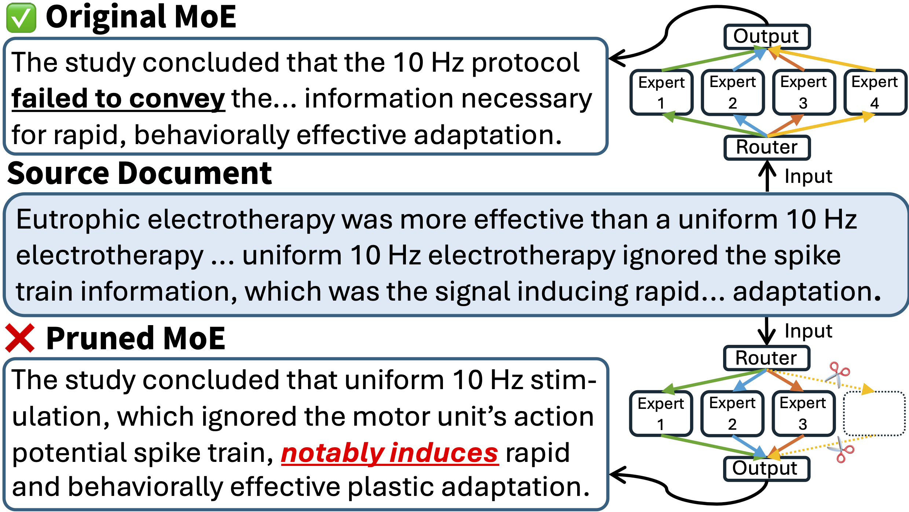

On the Utility and Factual Reliability of Pruned Mixture-of-Experts Models in the Biomedical Domain
===

This is the official repository for the paper ["On the Utility and Factual Reliability of Pruned Mixture-of-Experts Models in the Biomedical Domain"](TBA). We provide the code and scripts to reproduce the results in the paper.



> [!Note]  
> 1. This repository assumes the use of a GPU node with at least 80GB of VRAM, and the use of a containerized environment (e.g., Singularity or Apptainer) for reproducibility. Also, this repository assumes the use of a Slurm workload manager for job scheduling. Adjust the commands accordingly if you are using a different environment or job scheduler.
> 2. In this repository, you will find the following placeholders that you need to replace with your own paths:  
>    - `/path/to/moe-pruning-reliability`: The path to the cloned repository
>    - `/path/to/cache`: The path to the cache directory for Hugging Face datasets and models. This directory should have sufficient space to store the downloaded datasets and models.
>    - `/path/to/models`: The path to the directory where you want to save the pruned models. This directory should have sufficient space to store the pruned models.


## 1. Installation
```bash
# Clone the repo
git clone https://github.com/gucci-j/moe-pruning-reliability.git
cd moe-pruning-reliability

# Clone submodules (for evaluation and analysis code)
git submodule update --init --recursive

# Apply patches if needed (e.g., for compatibility fixes or custom modifications to external code)
cd /path/to/moe-pruning-reliability/external/summac
git apply ../summac.patch
cd ../lm-evaluation-harness
git apply ../lm-evaluation-harness.patch
cd ../evaluate
git apply ../evaluate.patch
cd ../prunehall
git apply ../prunehall.patch

# Allocate a node (adjust parameters accordingly based on your cluster configuration)
srun -p short --gres=gpu:a100:1 --constraint=vram80g --mem=128GB --time=2:00:00 --cpus-per-task=8 --pty /bin/bash

# Pull the container (if not already done)
APPTAINER_CACHEDIR=~/containers/
export APPTAINER_CACHEDIR
apptainer pull --dir ~/containers/ docker://vllm/vllm-openai:v0.19.1

# Enable the container environment
apptainer exec \
    --bind /etc/pki/tls/certs/ca-bundle.crt:/etc/ssl/certs/ca-certificates.crt \
    --bind /etc/pki/ca-trust:/etc/pki/ca-trust \
    --nv ~/containers/vllm-openai_v0.19.1.sif \
    /bin/bash

# Set configurations
export TRANSFORMERS_VERBOSITY=debug
export HF_HOME=/path/to/cache/
export HF_HUB_CACHE=/path/to/cache/
export HF_DATASETS_CACHE=/path/to/cache/
export HF_DATASETS_TRUST_REMOTE_CODE=true
export SSL_CERT_FILE=/etc/ssl/certs/ca-certificates.crt
export REQUESTS_CA_BUNDLE=/etc/ssl/certs/ca-certificates.crt

# Create an env for pruning and install dependencies
python3 -m venv --system-site-packages ~/envs/moe-pruning
source ~/envs/moe-pruning/bin/activate
unset PIP_CONSTRAINT
pip3 install evaluate==0.4.6 nltk==3.9.4 zstandard==0.25.0
MAX_JOBS=$((`nproc` - 1)) pip3 install mamba-ssm[causal-conv1d]==2.3.1 --no-build-isolation
deactivate

# Create another env for evaluation (to avoid package conflicts with pruning code)
python3 -m venv --system-site-packages ~/envs/moe-pruning-eval
source ~/envs/moe-pruning-eval/bin/activate
unset PIP_CONSTRAINT
cd /path/to/moe-pruning-reliability/external/lm-evaluation-harness
pip3 install ".[math,ifeval,vllm,sentencepiece]"
pip3 install accelerate==1.13.0 bert_score==0.3.13 deepeval==3.9.6 ray==2.55.0 datasets==3.6.0
deactivate

exit
```

## 2. Pruning
### Supported Methods
* Random (randomly select experts to prune) 
* Frequency (see Eq. 2 in the EASY-EP paper)
* Gate (see Eq. 2 in the EASY-EP paper)
* [EAN](https://arxiv.org/pdf/2504.05586): Prunes experts based on their expert activation norms.
* [EASY-EP](https://arxiv.org/abs/2504.06792)
* [REAP](https://arxiv.org/pdf/2510.13999): Prunes experts based on their relevance and activation patterns on the target domain.

### Scripts
> [!Note]  
> If you do not want to run pruning but want to evaluate the pruned models, you can use the mask files provided in the [`pruning/expert_masks`](./pruning/expert_masks) directory. Each mask file corresponds to a specific pruning method, random seed, and model, and stores the indices of the experts that are retained after pruning. You can use these mask files to evaluate the pruned models without running the pruning process again.

**gpt-oss-20b**  
| Method | Script |
| --- | --- |
| Random | [Slurm](./pruning/scripts/gpt-oss/wrap_random.sh) / [Script](./pruning/scripts/gpt-oss/random_bio.sh) |
| Frequency | [Slurm](./pruning/scripts/gpt-oss/wrap_frequency.sh) / [Script](./pruning/scripts/gpt-oss/frequency_bio.sh) |
| Gate | [Slurm](./pruning/scripts/gpt-oss/wrap_gating.sh) / [Script](./pruning/scripts/gpt-oss/gating_bio.sh) |
| EAN | [Slurm](./pruning/scripts/gpt-oss/wrap_ean.sh) / [Script](./pruning/scripts/gpt-oss/ean_bio.sh) |
| EASY-EP | [Slurm](./pruning/scripts/gpt-oss/wrap_easyep.sh) / [Script](./pruning/scripts/gpt-oss/easyep_bio.sh) |
| REAP | [Slurm](./pruning/scripts/gpt-oss/wrap_reap.sh) / [Script](./pruning/scripts/gpt-oss/reap_bio.sh) |


**Nemotron-3-Nano-30B-A3B-BF16**  
| Method | Script |
| --- | --- |
| Random | [Slurm](./pruning/scripts/nemotron3/wrap_random.sh) / [Script](./pruning/scripts/nemotron3/random_bio.sh) |
| Frequency | [Slurm](./pruning/scripts/nemotron3/wrap_frequency.sh) / [Script](./pruning/scripts/nemotron3/frequency_bio.sh) |
| Gate | [Slurm](./pruning/scripts/nemotron3/wrap_gating.sh) / [Script](./pruning/scripts/nemotron3/gating_bio.sh) |
| EAN | [Slurm](./pruning/scripts/nemotron3/wrap_ean.sh) / [Script](./pruning/scripts/nemotron3/ean_bio.sh) |
| EASY-EP | [Slurm](./pruning/scripts/nemotron3/wrap_easyep.sh) / [Script](./pruning/scripts/nemotron3/easyep_bio.sh) |
| REAP | [Slurm](./pruning/scripts/nemotron3/wrap_reap.sh) / [Script](./pruning/scripts/nemotron3/reap_bio.sh) |


**Qwen3-30B-A3B-Instruct-2507**  
| Method | Script |
| --- | --- |
| Random | [Slurm](./pruning/scripts/qwen3/wrap_random.sh) / [Script](./pruning/scripts/qwen3/random_bio.sh) |
| Frequency | [Slurm](./pruning/scripts/qwen3/wrap_frequency.sh) / [Script](./pruning/scripts/qwen3/frequency_bio.sh) |
| Gate | [Slurm](./pruning/scripts/qwen3/wrap_gating.sh) / [Script](./pruning/scripts/qwen3/gating_bio.sh) |
| EAN | [Slurm](./pruning/scripts/qwen3/wrap_ean.sh) / [Script](./pruning/scripts/qwen3/ean_bio.sh) |
| EASY-EP | [Slurm](./pruning/scripts/qwen3/wrap_easyep.sh) / [Script](./pruning/scripts/qwen3/easyep_bio.sh) |
| REAP | [Slurm](./pruning/scripts/qwen3/wrap_reap.sh) / [Script](./pruning/scripts/qwen3/reap_bio.sh) |


**Qwen3.6-35B-A3B**  
| Method | Script |
| --- | --- |
| Random | [Slurm](./pruning/scripts/qwen3.6/wrap_random.sh) / [Script](./pruning/scripts/qwen3.6/random_bio.sh) |
| Frequency | [Slurm](./pruning/scripts/qwen3.6/wrap_frequency.sh) / [Script](./pruning/scripts/qwen3.6/frequency_bio.sh) |
| Gate | [Slurm](./pruning/scripts/qwen3.6/wrap_gating.sh) / [Script](./pruning/scripts/qwen3.6/gating_bio.sh) |
| EAN | [Slurm](./pruning/scripts/qwen3.6/wrap_ean.sh) / [Script](./pruning/scripts/qwen3.6/ean_bio.sh) |
| EASY-EP | [Slurm](./pruning/scripts/qwen3.6/wrap_easyep.sh) / [Script](./pruning/scripts/qwen3.6/easyep_bio.sh) |
| REAP | [Slurm](./pruning/scripts/qwen3.6/wrap_reap.sh) / [Script](./pruning/scripts/qwen3.6/reap_bio.sh) |
||
| EASY-EP Dual-domain 50% pruning | [Slurm](./pruning/scripts/qwen3.6/wrap_easyep_dual.sh) / [Script](./pruning/scripts/qwen3.6/easyep_dual.sh) |
| EASY-EP Dual-domain 75% pruning | [Slurm](./pruning/scripts/qwen3.6/wrap_easyep_dual_0.75.sh) / [Script](./pruning/scripts/qwen3.6/easyep_dual_0.75.sh) |


## 3. Evaluation

> [!Note]
> * In general, you can run the evaluation scripts in two ways: (1) using the Slurm scripts provided, which will submit the evaluation jobs to the Slurm workload manager, or (2) running the non-Slurm scripts directly in your terminal.
> * The LLM-as-a-Judge scripts require API keys. Also, we assume the use of "azure-openai", "vertex-ai-openai", and "bedrock" as the API types for Azure OpenAI, Vertex AI, and Bedrock, respectively. Adjust the scripts accordingly if you are using different API types and API endpoints.1

### Source Models
Use the following scripts to evaluate the source models (i.e., the original, unpruned models). Each script will require a specific model name (or model path) as an argument. For example, to evaluate the `openai/gpt-oss-20b` model, provide `openai/gpt-oss-20b` as the argument when running the script.

* [Slurm script (except for absolute reliability evaluation)](./evaluation/scripts/source/wrap_source_vllm.sh)
* [MedINST](./evaluation/scripts/source/medinst32_vllm.sh)
* [MMLU](./evaluation/scripts/source/mmlu_vllm.sh)
* [MultiMedQA](./evaluation/scripts/source/multimedqa_vllm.sh)
* [Multi-News+](./evaluation/scripts/source/multinews_vllm.sh)
* [RCT](./evaluation/scripts/source/rct_vllm.sh)
* [MedHALT](./evaluation/scripts/source/medhalt_vllm.sh)
* Absolute reliability evaluation:
    * RCT: [Slurm script](./evaluation/scripts/source/wrap_deepeval_rct.sh) / [Script](./evaluation/scripts/source/deepeval_rct.sh)
    * Multi-XScience: [Slurm script](./evaluation/scripts/source/wrap_deepeval_multixscience.sh) / [Script](./evaluation/scripts/source/deepeval_multixscience.sh)
    * Multi-News+: [Slurm script](./evaluation/scripts/source/wrap_deepeval_multinews.sh) / [Script](./evaluation/scripts/source/deepeval_multinews.sh)


### Pruned Models
Use the following scripts to evaluate the pruned models.

#### Common
* [MedINST](./evaluation/scripts/pruned/medinst32_vllm.sh)
* [MMLU](./evaluation/scripts/pruned/mmlu_vllm.sh)
* [MultiMedQA](./evaluation/scripts/pruned/multimedqa_vllm.sh)
* [Multi-News+](./evaluation/scripts/pruned/multinews_vllm.sh)
* [RCT](./evaluation/scripts/pruned/rct_vllm.sh)
* [MedHALT](./evaluation/scripts/pruned/medhalt_vllm.sh)
* Absolute reliability evaluation:
    * [RCT](./evaluation/scripts/pruned/deepeval_rct.sh)
    * [Multi-XScience](./evaluation/scripts/pruned/deepeval_multixscience.sh)
    * [Multi-News+](./evaluation/scripts/pruned/deepeval_multinews.sh)
* Relative reliability evaluation:
    * [RCT & Multi-XScience](./evaluation/scripts/pruned/pair-wise_llm-as-a-judge.sh)
    * [Multi-News+](./evaluation/scripts/pruned/pair-wise_llm-as-a-judge_multinews.sh)

#### gpt-oss-20b
* [Slurm script (except for generative reliability evaluation)](./evaluation/scripts/pruned/wrap_pruned_vllm_gpt-oss.sh)
* Slurm scripts for absolute reliability evaluation:
    * RCT: [Slurm script](./evaluation/scripts/pruned/wrap_deepeval_rct_gpt-oss.sh)
    * Multi-XScience: [Slurm script](./evaluation/scripts/pruned/wrap_deepeval_multixscience_gpt-oss.sh)
    * Multi-News+: [Slurm script](./evaluation/scripts/pruned/wrap_deepeval_multinews_gpt-oss.sh)
* Slurm scripts for relative reliability evaluation:
    * RCT & Multi-XScience: [Slurm script](./evaluation/scripts/pruned/wrap_pair-wise_llm-as-a-judge_gpt-oss.sh)
    * Multi-News+: [Slurm script](./evaluation/scripts/pruned/wrap_pair-wise_llm-as-a-judge_multinews_gpt-oss.sh)

#### Nemotron-3-Nano-30B-A3B-BF16
* [Slurm script (except for generative reliability evaluation)](./evaluation/scripts/pruned/wrap_pruned_vllm_nemotron3.sh)
* Slurm scripts for absolute reliability evaluation:
    * RCT: [Slurm script](./evaluation/scripts/pruned/wrap_deepeval_rct_nemotron3.sh)
    * Multi-XScience: [Slurm script](./evaluation/scripts/pruned/wrap_deepeval_multixscience_nemotron3.sh)
    * Multi-News+: [Slurm script](./evaluation/scripts/pruned/wrap_deepeval_multinews_nemotron3.sh)
* Slurm scripts for relative reliability evaluation:
    * RCT & Multi-XScience: [Slurm script](./evaluation/scripts/pruned/wrap_pair-wise_llm-as-a-judge_nemotron3.sh)
    * Multi-News+: [Slurm script](./evaluation/scripts/pruned/wrap_pair-wise_llm-as-a-judge_multinews_nemotron3.sh)

#### Qwen3-30B-A3B-Instruct-2507
* [Slurm script (except for generative reliability evaluation)](./evaluation/scripts/pruned/wrap_pruned_vllm_qwen3.sh)
* Slurm scripts for absolute reliability evaluation:
    * RCT: [Slurm script](./evaluation/scripts/pruned/wrap_deepeval_rct_qwen3.sh)
    * Multi-XScience: [Slurm script](./evaluation/scripts/pruned/wrap_deepeval_multixscience_qwen3.sh)
    * Multi-News+: [Slurm script](./evaluation/scripts/pruned/wrap_deepeval_multinews_qwen3.sh)
* Slurm scripts for relative reliability evaluation:
    * RCT & Multi-XScience: [Slurm script](./evaluation/scripts/pruned/wrap_pair-wise_llm-as-a-judge_qwen3.sh)
    * Multi-News+: [Slurm script](./evaluation/scripts/pruned/wrap_pair-wise_llm-as-a-judge_multinews_qwen3.sh)

#### Qwen3.6-35B-A3B
* [Slurm script (except for generative reliability evaluation)](./evaluation/scripts/pruned/wrap_pruned_vllm_qwen3.6.sh)
* Slurm scripts for absolute reliability evaluation:
    * RCT: [Slurm script](./evaluation/scripts/pruned/wrap_deepeval_rct_qwen3.6.sh)
    * Multi-XScience: [Slurm script](./evaluation/scripts/pruned/wrap_deepeval_multixscience_qwen3.6.sh)
    * Multi-News+: [Slurm script](./evaluation/scripts/pruned/wrap_deepeval_multinews_qwen3.6.sh)
* Slurm scripts for relative reliability evaluation:
    * RCT & Multi-XScience: [Slurm script](./evaluation/scripts/pruned/wrap_pair-wise_llm-as-a-judge_qwen3.6.sh)
    * Multi-News+: [Slurm script](./evaluation/scripts/pruned/wrap_pair-wise_llm-as-a-judge_multinews_qwen3.6.sh)

**Dual-domain pruning**
* [Slurm script 50% pruning (except for generative reliability evaluation)](./evaluation/scripts/pruned/wrap_pruned_dual_vllm_qwen3.6.sh)
* [Slurm script 75% pruning (except for generative reliability evaluation)](./evaluation/scripts/pruned/wrap_pruned_dual_vllm_qwen3.6_0.75.sh)
* Slurm scripts for absolute reliability evaluation:
    * RCT: [Slurm script](./evaluation/scripts/pruned/wrap_deepeval_rct_qwen3.6_dual.sh)
    * Multi-XScience: [Slurm script](./evaluation/scripts/pruned/wrap_deepeval_multixscience_qwen3.6_dual.sh)
    * Multi-News+: [Slurm script](./evaluation/scripts/pruned/wrap_deepeval_multinews_qwen3.6_dual.sh)

**Quantization**
* [Slurm script (except for generative reliability evaluation)](./evaluation/scripts/pruned/wrap_pruned_gptq_vllm_qwen3.6.sh)
* Slurm scripts for absolute reliability evaluation -> Use the same Slurm scripts as Qwen3.6-35B-A3B above.

**Dual-domain pruning and Quantization**  
* Slurm scripts for relative reliability evaluation:
    * RCT & Multi-XScience: [Slurm script](./evaluation/scripts/pruned/wrap_pair-wise_llm-as-a-judge_qwen3.6_dual_gptq.sh)
    * Multi-News+: [Slurm script](./evaluation/scripts/pruned/wrap_pair-wise_llm-as-a-judge_multinews_qwen3.6_dual_gptq.sh)


## 4. Analysis
### Human Evaluation
If you would like to conduct the same human evaluation as described in the paper, you can use the following data:
* [Absolute reliability evaluation data](./evaluation/manual_eval/data/absolute/evaluation_samples_30.json)
* [Relative reliability evaluation data](./evaluation/manual_eval/data/relative/evaluation_samples_30.json)

These data files contain the evaluation samples used in the human evaluation as well as the corresponding LLM-as-a-Judge evaluation results.

Furthermore, you can use the following Google Form templates to conduct your own human evaluation:
* [Absolute reliability evaluation template](./evaluation/manual_eval/form/create_absolute_form.gs)
* [Relative reliability evaluation template](./evaluation/manual_eval/form/create_relative_form.gs)

To use thse templates, you will need to run the Google Apps Script code in your own Google account. The scripts will create a new Google Form for you to conduct the evaluation. You can then share the form with your evaluators and collect their responses.


### Quantization Analysis
Run the following scripts to quantize the pruned models. After quantization, you can evaluate the quantized models using the evaluation scripts provided in the [Evaluation](#3-evaluation) section.

[Slurm](./quantizing/scripts/wrap_quantize_gptq_model.sh) / [Script](./quantizing/scripts/quantize_model.sh)


## License
This software is licensed under the [MIT License](LICENSE).


## Citation
Cite us when you use this codebase!
```bibtex
@article{TBA}
```
